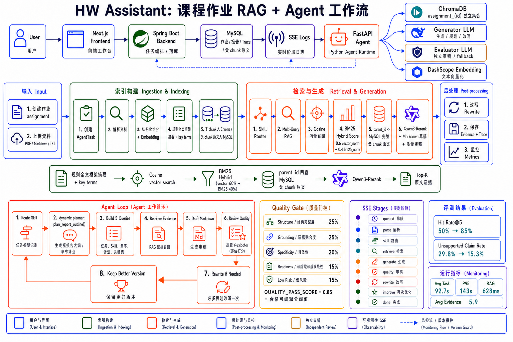
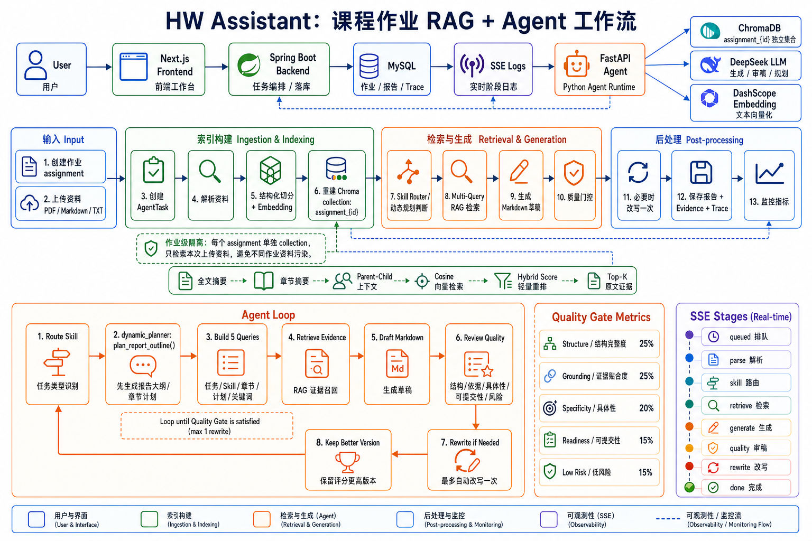

# FZU Homework Assistant

面向课程作业场景的 AI 作业资料工作台。项目把“上传资料、任务类型识别、作业级 RAG 检索、报告生成、独立质量审稿、自动改写、再次优化、报告保存、数据监控”串成一条可观测的 Agent 工作流，适合作为后端开发 / 大模型应用方向的简历项目展示。



> 白底图优先展示当前 RAG 链路、BM25 Hybrid、父 chunk 原文回查和 Agent 工作流；下方总览图展示系统架构、监控与评测结果。

## 项目亮点

- **Assignment-scoped RAG**：每个作业使用独立 ChromaDB collection，命名为 `assignment_{id}`，生成报告时只检索当前作业上传的资料，避免不同课程、不同作业之间的资料污染。
- **结构化索引与混合召回**：支持 PDF / Markdown / TXT 资料解析，按 Markdown 标题、PDF 页、段落块进行结构化切分；向量库子 chunk 仅写入 `section_title`、`parent_id`、关键词等轻量 metadata，全文摘要由规则提取标题框架、代表句和高频关键词生成。
- **Cosine 向量检索 + BM25 Hybrid Score**：ChromaDB collection 显式使用 `hnsw:space=cosine`；每路 query 同时执行 Chroma 向量召回和当前作业 child chunk 上的纯 Python BM25 召回，合并候选后按归一化向量相似度 `60%` + BM25 得分 `40%` 融合重排。
- **Query Simplification + Parent-Child Retrieval**：基础检索只保留 `assignment_query` 和 `structure_query`；动态 Planner 有报告计划时追加 `plan_query`；用 child chunk 精准命中，通过 `parent_id` 回查 MySQL 中的完整父 chunk 原文补足生成所需背景。
- **Skill Routing + Dynamic Planner**：支持实验报告、论文总结、课程问答等固定业务 Skill；低置信度任务进入 `dynamic_planner`，先生成报告大纲 / 章节计划，再基于计划检索和生成正文。
- **ReAct-lite Agent Loop**：Python Agent 按固定上限执行 `plan`、`retrieve`、`generate`、`quality`、`rewrite` 等步骤，避免无限循环，并输出完整 `agent_trace`。
- **轻量 Agentic RAG 闭环**：质量门控发现证据不足、章节缺失或 grounding 偏低时，最多触发 1 轮补充检索，合并新证据后重生成候选稿并重新评估，只采纳质量更高版本。
- **独立质量审稿**：从结构完整度、证据贴合度、具体性、可编辑成熟度、低风险五个维度审稿；支持单独配置 evaluator 模型，未配置时回退默认生成模型，降低生成器自评虚高风险。
- **自动改写与版本保护**：低于阈值时自动改写一次，并保留评分更高版本；再次优化使用上一版已保存质量分作为 baseline，只评估候选稿，避免 evaluator 波动导致低质量稿覆盖原稿；重试失败任务时保留原始操作类型。
- **端到端可观测性**：Python Agent 通过 NDJSON 流式回传逐阶段事件，Java 后端转发为 SSE 日志；前端展示中文化 AI 工作流、Agent Trace、RAG Evidence 和监控指标，并用定时刷新兜底避免收尾日志丢失。
- **Docker 一键启动**：前端、后端、Agent、MySQL、Redis、ChromaDB 通过 `docker compose` 编排，方便本地演示和 GitHub 复现。

## 系统架构



```text
Next.js Frontend
  |  作业管理 / 资料上传 / AI 工作流程 / 报告编辑 / 数据监控
  v
Spring Boot Backend
  |  任务编排 / SSE 日志 / 报告版本 / MySQL 持久化 / Redis 预留
  v
FastAPI Python Agent
  |  Skill Routing / Assignment-scoped RAG / Agent Loop / 独立质量审稿 / 自动改写 / 再次优化
  v
ChromaDB + Generator LLM + Evaluator LLM(optional) + DashScope Embedding
```

数据存储：

- **MySQL**：作业、资料、报告、Agent 任务、任务日志、检索证据、质量指标、Trace。
- **ChromaDB**：按作业隔离的向量 collection，使用 cosine space。
- **Redis**：已接入后端依赖，当前预留给运行中任务状态、最近访问上下文和 SSE 重连恢复。

## 核心流程

1. 用户创建作业，填写课程、标题、截止时间和任务说明。
2. 用户上传 PDF / Markdown / TXT 资料。
3. Java 后端创建异步 `AgentTask`，并通过 SSE 推送阶段日志；失败任务重试时保留原始任务类型。
4. 后端调用 Python Agent `/agent/index`。
5. Agent 删除并重建当前作业的 `assignment_{id}` collection。
6. Agent 解析资料，结构化切分 chunk，规则生成全文框架摘要和关键词；子 chunk 写入 ChromaDB，完整父 chunk 原文持久化到 MySQL。
7. 后端优先调用 `/agent/generate-report-stream` 或 `/agent/improve-report-stream`，Agent 逐阶段返回 NDJSON 事件；流式不可用时回退非流式接口。
8. 如果进入 `dynamic_planner`，Agent 先生成报告大纲 / 章节计划。
9. Agent 构造 `assignment_query`、`structure_query`，动态 Planner 场景追加 `plan_query`；每路 query 执行 cosine 向量召回和 BM25 child chunk 召回，合并候选后回查父 chunk 原文并按 hybrid score 重排。
10. Agent 基于全文框架摘要、父 chunk 原文上下文和 Top-K 原文证据生成 Markdown 草稿。
11. 质量门控使用 evaluator 审稿；若证据不足可触发一次补充检索，必要时自动改写一次，并保留更好版本。
12. Java 后端保存报告、retrieved evidence、quality metrics 和 agent trace。
13. 前端展示报告草稿、质量结果卡片、AI 工作流、RAG evidence 和数据监控指标。
14. 用户编辑草稿或补充资料后，可点击“再次优化”：系统先保存当前草稿，以上一版保存质量分作为 baseline，再结合当前草稿与最新资料生成候选稿；候选稿评分更低时保留原稿并说明原因。

## Agent Loop

普通固定 Skill 的主要步骤：

```text
search_materials -> build_report_draft -> check_report_quality
-> retrieve_repair/regenerate(optional) -> rewrite_report(optional)
```

`dynamic_planner` 会额外增加规划步骤：

```text
plan_report_outline -> search_materials -> build_report_draft -> check_report_quality
-> retrieve_repair/regenerate(optional) -> rewrite_report(optional)
```

每一步都会记录：

- `step_index`
- `stage`
- `tool_name`
- `input_summary`
- `output_summary`
- `status`
- `duration_ms`
- `details`

质量审稿返回：

- `structure_score`
- `grounding_score`
- `specificity_score`
- `readiness_score`
- `risk_score`
- `total_score`
- `decision`: `PASS` / `NEEDS_REWRITE` / `NEEDS_USER_INPUT`

质量门控采用五维加权：结构完整性 `25%`、证据贴合度 `25%`、内容具体性 `20%`、可继续编辑成熟度 `15%`、低风险 `15%`。其中低风险在代码中由 `(1 - risk_score)` 计入总分。`QUALITY_PASS_SCORE=0.85` 表示“合格可编辑初稿”的通过线，不代表最终可直接提交。该模块定位是自动质量门控，不是完全客观的最终评测；项目支持通过独立 evaluator 模型和更严格的审稿 prompt 降低生成器自评虚高风险，并结合章节完整率、检索证据数量和占位符检测等本地信号辅助判断。质量结果会保存 evaluator 来源，前端质量卡片可显示“独立审稿模型评分”或“默认审稿器评分”。对于再次优化，系统优先使用上一版已保存质量分作为比较基准，避免同一原稿被重复评分时出现波动并影响版本采纳。

## RAG 设计

本项目不是通用知识库 RAG，而是 **Assignment-scoped RAG / 任务级临时资料库 RAG**。

```text
assignment_1 -> collection: assignment_1
assignment_2 -> collection: assignment_2
assignment_3 -> collection: assignment_3
```

生成某个作业报告时，只会打开当前作业的 collection。重新生成报告时，会先删除并重建当前作业 collection，因此索引总是和本次上传资料保持一致。

检索链路：

```text
全文框架摘要 + key terms
  +
基础 query:
  assignment_query
  structure_query
  + plan_query(dynamic_planner only)
  ↓
每路 query 双路召回:
  ChromaDB cosine vector search
  BM25 search over current assignment child chunks
  ↓
vector candidates ∪ bm25 candidates
  ↓
Parent-Child 上下文合并：parent_id 回查 MySQL 父 chunk 原文
  ↓
Hybrid Score = 0.6 * vector_norm + 0.4 * bm25_norm
  ↓
Qwen3-Rerank(optional)
  ↓
Top-K 原文证据进入报告生成 prompt
```

`retrieved_evidence` 会包含：

- `chunk_id`
- `material_id`
- `filename`
- `parent_id`
- `section_title`
- `vector_score`
- `keyword_score`
- `hybrid_score`
- `excerpt`

## Skill 机制

项目实现的是**自研业务 Skill Registry**，不是 Codex/Claude 标准工具型 Skill 包。

每个业务 Skill 位于：

```text
agent-python/app/skills/{skill_id}/
  skill.json
  SKILL.md
```

`skill.json` 定义机器可读元数据：

- `id`
- `label`
- `description`
- `entry`
- `system_prompt`
- `query_hint`
- `required_sections`
- `output_requirements`

`SKILL.md` 定义该作业类型的详细生成规范。Agent 会根据路由结果加载对应 Skill，把 `system_prompt` 作为 system message，并把 `SKILL.md` 内容拼入生成 prompt。

当前内置 Skill：

- `lab_report`：实验报告、编程实践、算法实现。
- `paper_summary`：论文阅读、文献总结、课堂汇报。
- `course_qa_report`：课程资料问答、讲解、汇报总结。
- `dynamic_planner`：开放型任务，先规划报告结构再生成内容。

## Prompt 位置

- Skill system prompt：`agent-python/app/skills/*/skill.json`
- Skill 详细说明：`agent-python/app/skills/*/SKILL.md`
- 报告生成 prompt：`agent-python/app/main.py` 的 `build_prompt`
- Skill 路由 prompt：`agent-python/app/main.py` 的 `route_skill_with_llm`
- Planner prompt：`agent-python/app/agent_runtime.py` 的 `plan_report_outline`
- 改写 prompt：`agent-python/app/agent_runtime.py` 的 `rewrite_report`
- 质量审稿 prompt：`agent-python/app/agent_runtime.py` 的 `review_quality_with_llm`

## 技术栈

| 模块 | 技术 |
| --- | --- |
| Frontend | Next.js 14, React 18, TypeScript, Tailwind CSS, lucide-react |
| Backend | Spring Boot 3, Java 21, MyBatis Plus, MySQL, Redis, SSE, SLF4J |
| Agent | FastAPI, Pydantic, OpenAI-compatible SDK, ChromaDB, pypdf |
| LLM Provider | DeepSeek OpenAI-compatible API, DashScope Embedding |
| DevOps | Docker Compose |

## 快速启动

### 1. 准备环境变量

```bash
cp .env.example .env
```

编辑 `.env`，填入 DeepSeek API Key 和 DashScope Embedding API Key：

```env
LLM_PROVIDER=deepseek
LLM_BASE_URL=https://api.deepseek.com
LLM_MODEL=deepseek-v4-flash
DEEPSEEK_API_KEY=your_deepseek_api_key
EVALUATOR_BASE_URL=
EVALUATOR_MODEL=
EVALUATOR_API_KEY=
EMBEDDING_BASE_URL=https://dashscope.aliyuncs.com/compatible-mode/v1
EMBEDDING_MODEL=text-embedding-v2
DASHSCOPE_API_KEY=your_dashscope_api_key
QUALITY_PASS_SCORE=0.85
RERANK_ENABLED=true
RERANK_MODEL=qwen3-rerank
RERANK_API_KEY=
RERANK_CANDIDATE_MULTIPLIER=6
RERANK_TIMEOUT_SECONDS=30
```

`EVALUATOR_*` 可选；不配置时质量审稿回退使用默认生成模型。配置后，报告质量卡片会显示独立审稿模型来源。

真实密钥只放本地 `.env`，不要提交到 GitHub。

### 2. 启动服务

```bash
docker compose up --build
```

默认服务地址：

- Frontend: http://localhost:3000
- Backend API: http://localhost:8080
- Python Agent Docs: http://localhost:8000/docs
- ChromaDB: http://localhost:8001

Docker 网络内 Agent 访问 ChromaDB 使用容器端口 `8000`；宿主机本地开发默认访问映射端口 `8001`。

## 常用命令

前端类型检查：

```bash
cd frontend
npm.cmd run typecheck
```

后端打包：

```bash
cd backend-java
mvn -q -DskipTests package
```

Python Agent 单测：

```bash
python -m unittest discover agent-python/tests
```

查看 Docker 服务：

```bash
docker compose ps
```

查看日志：

```bash
docker compose logs -f backend-java
docker compose logs -f agent-python
docker compose logs -f frontend
```

## API 概览

Backend：

- `GET /api/dashboard/summary`
- `GET /api/assignments`
- `POST /api/assignments`
- `PUT /api/assignments/{id}`
- `DELETE /api/assignments/{id}`
- `GET /api/assignments/{id}`
- `POST /api/assignments/{id}/materials`
- `DELETE /api/materials/{id}`
- `POST /api/assignments/{id}/generate`
- `POST /api/assignments/{id}/improve-report`
- `GET /api/assignments/{id}/tasks`
- `GET /api/tasks/{taskId}`
- `POST /api/tasks/{taskId}/retry`
- `GET /api/tasks/{taskId}/events`
- `GET /api/monitoring/overview`
- `GET /api/reports/{assignmentId}`
- `PUT /api/reports/{reportId}`
- `GET /api/reports/{assignmentId}/export`

Agent：

- `GET /health`
- `GET /agent/skills`
- `POST /agent/index`
- `POST /agent/generate-report`
- `POST /agent/improve-report`

## Eval Harness

评测脚本位于 `agent-python/evals`，支持离线统计与 baseline / rerank 对照实验：

- `Skill Routing Accuracy`
- `MRR`
- `Section Completeness`
- `Hit Rate@5`
- `Unsupported Claim Rate`
- `Citation / Evidence Coverage`
- `Rewrite Trigger Rate`
- `Baseline vs Qwen3-Rerank Comparison`

示例：

```bash
cd agent-python
python evals/eval_harness.py evals/sample_results.jsonl --k 5
```

当前 hard eval 数据集包含 20 条人工设计 case，覆盖实验报告、论文总结、课程问答与动态规划任务。Qwen3-Rerank 对照实验结果：

- `Hit Rate@5`：baseline `50%` -> rerank `85%`
- `Unsupported Claim Rate`：baseline `29.8%` -> rerank `15.3%`
- miss -> hit case：`7`，hit -> miss case：`0`

如果要扩展评测集，可以在本地私有维护 `agent-python/tests/fixtures/rag_eval/cases.json`，并把对应材料放到 `agent-python/tests/fixtures/rag_eval/materials/`。评测样本和材料正文不提交到公开仓库，仓库只保留评测脚本、指标口径和可公开的汇总结果。

## 项目结构

```text
.
├── frontend/              # Next.js 前端工作台与监控页
├── backend-java/          # Spring Boot 后端编排、持久化、SSE
├── agent-python/          # FastAPI Agent、RAG、Skill、质量审稿
│   ├── app/
│   │   ├── main.py
│   │   ├── agent_runtime.py
│   │   └── skills/
│   ├── evals/
│   └── tests/
├── docs/
│   └── assets/
│       ├── workflow-overview.png
│       └── rag-workflow-overview.png
├── docker-compose.yml
├── AGENTS.md
├── ROADMAP.md
└── README.md
```

## 适合写进简历的描述

> 基于 Spring Boot + FastAPI + Next.js 构建课程作业 Agent 工作台，接入 DeepSeek OpenAI-compatible API、DashScope Embedding、Qwen3-Rerank、ChromaDB 和 MySQL，实现作业级隔离 RAG、结构化资料索引、确定性 Query Simplification、Parent-Child Retrieval、向量相似度 60% + BM25 关键词得分 40% 的 Hybrid Score 重排、Skill Routing、动态报告规划、模型质量门控、自动改写和报告版本保存；基础检索只保留 `assignment_query` 与 `structure_query`，动态 Planner 追加 `plan_query`，每路 query 同时执行向量召回和 BM25 child chunk 召回；向量库子 chunk 仅保留 `parent_id` 等轻量 metadata，父上下文通过 MySQL 回查完整父 chunk 原文；基于 MySQL 持久化 Agent Trace、检索证据和质量指标，构建可观测数据监控页，支持任务完成率、质量通过率、P95 耗时、改写率、阶段耗时和检索指标统计；在 20 条 hard eval case 上，Hit Rate@5 从 50% 提升到 85%，Unsupported Claim Rate 从 29.8% 降至 15.3%。

## 安全说明

- `.env`、`.docker-config/`、`.m2/`、`node_modules/`、`.next/`、`target/`、上传资料和本地缓存均已加入忽略规则。
- 仓库只保留 `.env.example` 作为配置模板。
- 日志不输出 API Key、完整 Prompt 或完整资料正文，只输出摘要、数量、阶段、耗时和错误类型。
