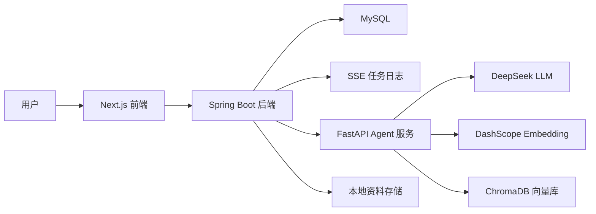
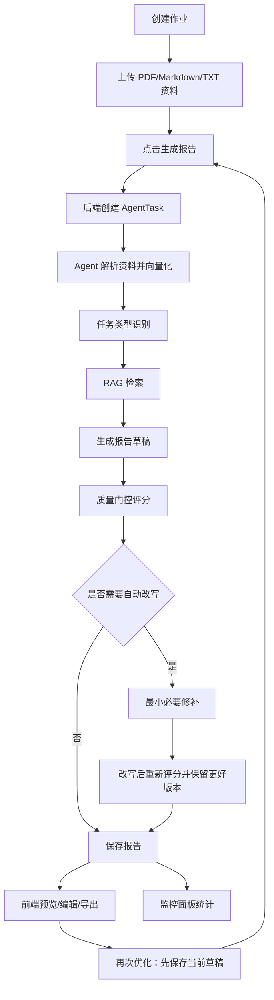

# 项目流程梳理与面试讲解稿

## 项目定位

这是一个面向课程作业场景的 AI 报告生成与质量监控系统。用户创建作业、上传课程资料后，系统会自动解析资料、构建向量索引、选择合适的生成 Skill，基于 RAG 生成中文 Markdown 报告，并通过质量门控判断是否需要自动改写。后端记录完整任务日志和 Agent trace，前端提供报告编辑、导出和数据监控面板。

一句话讲法：

> 我做的是一个带 RAG、任务类型识别、质量门控、自动改写和数据监控的作业报告生成 Agent 系统，不只是简单调用大模型生成文本。

## 技术栈

- 前端：Next.js、React、TypeScript、Tailwind CSS、SSE/EventSource。
- 后端：Spring Boot 3、Java 21、MyBatis Plus、MySQL、RestClient、SSE、异步任务。
- Agent 服务：FastAPI、OpenAI-compatible SDK、DeepSeek、DashScope text-embedding、ChromaDB、pypdf。
- 工程化：Docker Compose、单元测试、评测脚本、任务日志与监控面板。

## 总体架构



核心职责：
- 前端负责作业管理、资料上传、报告预览编辑、任务进度展示、监控面板。
- Spring Boot 负责业务数据、文件存储、任务创建、异步任务调度、SSE 日志、报告版本。
- Python Agent 负责资料解析、向量化、RAG 检索、任务类型识别、报告生成、质量检查和自动改写。
- ChromaDB 存储每个作业的资料向量索引。
- MySQL 存储作业、材料、报告、任务、任务日志和 Agent 结果 JSON。

## 数据模型

主要表：
- `assignments`：作业元信息，包括标题、课程、描述、截止时间、用户选择的 skill、最终解析出的 skill、状态。
- `materials`：上传资料元信息，包括文件名、大小、存储路径、索引状态。
- `agent_tasks`：一次生成任务，包括状态、当前阶段、任务类型识别结果、检索证据、质量指标、Agent trace。
- `agent_task_logs`：任务阶段日志，用于前端 SSE 展示。
- `reports`：生成后的 Markdown 报告，支持版本递增和导出。

## 用户主流程



## 资料上传与索引流程

1. 用户在前端选择作业并上传资料。
2. 后端 `AssignmentService.uploadMaterial` 保存文件到本地 `storage/uploads/{assignmentId}`。
3. `materials` 表记录文件名、大小、路径和 `PENDING` 状态。
4. 用户点击生成报告后，后端调用 Agent `/agent/index`。
5. Agent 根据文件类型解析：
   - PDF：`pypdf` 提取文本。
   - Markdown/TXT：直接读取文本。
6. Agent 使用滑动窗口切分文本：
   - 默认 chunk size 约 900 字符。
   - overlap 约 160 字符。
7. Agent 调用 embedding 模型生成向量。
8. Agent 将 chunk、metadata、embedding upsert 到 ChromaDB 的 `assignment_{id}` collection。
9. 后端把资料状态改成 `INDEXED`，并推送“资料解析完成”日志。

配置说明：
- Docker 内部网络中，Agent 通过 `CHROMA_HOST=chromadb` 和 `CHROMA_PORT=8000` 访问 ChromaDB。
- 宿主机本地开发时，ChromaDB 默认映射到 `localhost:8001`，Agent 本地默认端口也是 `8001`。

面试讲法：

> 我没有把整份 PDF 直接塞给大模型，而是先解析并按窗口切片，再用 embedding 建索引。生成时只取与作业目标最相关的片段，降低上下文长度和无关信息干扰。

## 任务类型识别流程

系统支持几类 Skill：
- `lab_report`：实验报告、编程实践、算法实现。
- `paper_summary`：论文阅读、文献总结、创新点分析。
- `course_qa_report`：课程材料问答和讲解。
- `dynamic_planner`：动态任务规划，面向开放型任务动态设计报告结构。

路由流程：

1. 如果用户手动选择了 Skill，直接使用该 Skill。
2. 如果用户选择 `AUTO`，先走规则路由：
   - 根据标题、课程、描述中的关键词统计命中。
   - 如果某类 Skill 高置信命中，就直接选择。
3. 如果规则路由不确定，再调用 LLM 路由。
4. 如果 LLM 也没有高置信命中，就进入 `dynamic_planner`。

面试讲法：

> 任务类型识别是为了避免所有任务都用同一个 prompt。实验报告、论文总结、课程问答的结构差异很大，所以我先用规则做低成本判断，不确定时再让 LLM 做动态识别，最后兜底到动态任务规划。

## RAG 检索流程

当前检索 query 使用确定性多路扩展：

```text
assignment_query = 作业标题 + 课程名 + 作业描述
skill_query = Skill 标签 + 必要章节 + skill.query_hint
section_query = 必要章节 + 作业要求
```

流程：
1. Agent 构造 3 路确定性 query，不使用自由式 LLM query rewrite。
2. 每路 query 分别送入 embedding 模型。
3. 使用多路 query embedding 到 ChromaDB 检索候选片段。
4. 按 `chunk_id` 去重，并按相似度分数排序截断到 `top_k`。
5. 检索结果包含：
   - `chunk_id`
   - `material_id`
   - `filename`
   - `score`
   - `excerpt`
6. Agent 把检索结果格式化为带来源标签的上下文。

当前特点：
- 稳定、可解释、成本低。
- 比单 query 更容易覆盖不同资料区域。
- Agent trace 会记录 query 数量、每路命中数、去重后片段数。

面试讲法：

> 我没有直接做自由式 LLM query rewrite，而是做了可解释的多路 query 扩展。任务 query、Skill query、章节 query 分别召回，再按 chunk 去重，这样比模型自由改写 query 更稳定，也更容易在面试中讲清楚。

## 报告生成流程

生成 prompt 包含：
- 作业标题、课程、描述。
- RAG 检索到的资料片段。
- 当前 Skill 的必要章节。
- Skill 说明文档。
- 输出约束。

关键约束：
- 只输出 Markdown 正文。
- 生成结果尽量接近可提交状态。
- 不输出 `以下是`、`改写版`、`最小必要修补版` 等元说明。
- 不主动输出 `待补充`、`资料不足`、`TODO`、`TBD` 等占位符。
- 使用资料时添加 `[来源: filename]` 形式的来源标注。
- 也支持更精确的 `[来源: filename#chunk_id]` 或 `[chunk_id: id]` 标注，便于后续做证据定位和 claim-evidence 评测。

面试讲法：

> 我把 prompt 拆成系统角色、作业信息、检索证据、Skill 结构和输出约束几块，让模型既能按照任务类型组织内容，又能尽量基于资料生成，减少泛泛而谈。

## 质量门控流程

生成报告后，Agent 会进入质量检查阶段。

质量检查输入：
- 生成的 Markdown。
- 必要章节列表。
- RAG 检索证据。
- 本地信号：
  - 章节完整率。
  - 证据片段数与证据贴合信号。
  - 检索片段数。
  - 草稿长度。

模型审稿由 evaluator 链路完成。配置 `EVALUATOR_BASE_URL`、`EVALUATOR_MODEL`、`EVALUATOR_API_KEY` 时使用独立审稿模型；未配置时回退默认生成模型，保证本地演示不被额外配置卡住。质量卡片会记录并展示审稿来源。

模型审稿维度：
- `structure`：结构是否完整、层次是否清楚。
- `grounding`：是否忠实使用证据。
- `specificity`：是否有具体步骤、指标和建议。
- `readiness`：是否达到可继续编辑的初稿成熟度。
- `risk`：是否存在幻觉、无依据断言、任务跑偏、资料不足等风险。

总分计算：
- 模型返回五个维度评分和审稿意见。
- 系统不直接信任模型返回的 `total_score`，而是按本地权重重算总分，避免模型自报总分过高。
- 当前权重为：结构 25%、证据贴合 25%、具体性 20%、可编辑成熟度 15%、低风险 15%。

证据支撑信号：
- 前端不再展示“引用覆盖率”，避免用户误解为报告质量本身。
- 离线评测中用 `Unsupported Claim Rate` 衡量生成断言是否被检索证据支持。

系统输出：
- `total_score`
- `pass_score`
- `decision`
- `review_summary`
- `issues`
- `rewrite_focus`
- `manual_review_reason`

决策规则：
- 如果模型判断需要用户输入，返回 `NEEDS_USER_INPUT`。
- 如果没有证据且内容很短，返回 `NEEDS_USER_INPUT`。
- 如果章节不完整，返回 `NEEDS_REWRITE`。
- 如果包含真正的占位符，如 `TODO`、`TBD`、`待填写`，返回 `NEEDS_REWRITE`。
- 如果总分大于等于阈值，返回 `PASS`。
- 其他情况返回 `NEEDS_REWRITE`。

当前阈值：
- `QUALITY_PASS_SCORE=0.85`，语义是“合格可编辑初稿”的通过线，不表示最终可直接提交。

面试讲法：

> 质量门控不是简单判断文本长度，而是独立审稿链路和本地规则结合。审稿模型负责判断结构、证据、具体性和可编辑成熟度，本地规则负责处理章节完整率和明显占位符，避免生成模型自评虚高或偶然误判。

## 自动改写流程

自动改写不是无条件触发。

触发条件：
- 报告非空。
- 质量决策为 `NEEDS_REWRITE`。
- 不是 `NEEDS_USER_INPUT`。
- 没有明显人工确认类占位符。
- Agent trace 还没有超过最大步骤数。

改写策略：
- 不是完全重写，而是“最小必要修补”。
- 重点修复结构、表达、具体性和来源标注。
- 保留原稿中的有效内容、数据、结论和来源。
- 不主动新增 `待补充`、`资料不足`、`TODO`、`TBD`。
- 输出直接作为报告正文，不写修改说明。

版本保护：
1. 保存初稿和初稿质量分。
2. 调用改写模型生成新稿。
3. 对新稿再次质量评分。
4. 如果新稿分数大于等于初稿，采用新稿。
5. 如果新稿分数低于初稿，保留初稿，并记录 `accepted_rewrite=false`。

面试讲法：

> 自动改写阶段我加了版本保护。因为 LLM 改写可能会删掉证据或过度润色，导致分数下降。所以系统会对改写稿重新评分，只保留更好的版本，避免低质量改写覆盖原稿。

## 再次优化草稿流程

再次优化面向用户已经编辑过草稿或补充过资料的场景，不是简单重新生成。

流程：
1. 前端点击“再次优化”时，先保存当前编辑器里的草稿。
2. 后端创建新的优化任务，传入当前草稿、原始草稿、作业信息和最新资料状态。
3. Agent 重新检索当前 assignment collection，只使用本作业资料。
4. Agent 在保留用户有效编辑的前提下生成新草稿。
5. 新草稿进入同一质量审稿链路重新评分。
6. 如果新稿评分不低于原稿，采用新稿；如果更低，保留原稿，并在质量反馈中说明原因。

面试讲法：

> 我没有把“再次优化”做成覆盖式重新生成，而是先保存用户编辑，再把当前稿和原始稿一起作为上下文交给 Agent。优化结果仍然经过质量门控和版本保护，避免用户手动修改被低分新稿覆盖。

## 任务日志与 SSE 流程

1. 前端点击生成报告。
2. 后端创建 `AgentTask`，状态为 `QUEUED`。
3. 前端通过 `EventSource` 订阅 `/api/tasks/{taskId}/events`。
4. 后端每个阶段调用 `TaskLogService.push`：
   - 写入 `agent_task_logs` 表。
   - 更新 `agent_tasks.current_stage` 和状态。
   - 通过 SSE 推给前端。
5. 前端收到日志后更新流程状态，并在任务完成后重新加载报告详情。

典型阶段：
- `queued`
- `parse`
- `skill`
- `retrieve`
- `generate`
- `quality`
- `rewrite`
- `done`
- `failed`

注意：
- `parse` 阶段由 Java 后端在调用 `/agent/index` 前后实时推送。
- Python Agent 内部的 `skill/retrieve/generate/quality/rewrite` trace 仍是一次性返回给后端，后端按阶段补充任务日志。
- 前端 SSE 是任务日志级别的实时展示，还不是逐 token 或逐工具流式回传。
- SSE 连接设置了 10 分钟超时，并在 `FAILED` 或 `done` 终态后主动完成连接。

异步执行：
- `AssignmentController` 只负责创建任务并返回 `AgentTask`。
- `AgentTaskRunner` 作为独立 Spring Bean 承载 `@Async`，再调用 `AgentWorkflowService.runReportTask`。
- 这样避免同一个 Service 内部自调用绕过 Spring AOP，重试任务也不会阻塞接口请求。

## 数据监控流程

监控接口：
- `/api/monitoring/overview`

监控数据来源：
- `assignments`
- `materials`
- `reports`
- `agent_tasks`
- `agent_trace_json`
- `quality_metrics_json`

当前监控指标：
- `totalTasks`：生成任务数。
- `taskCompletionRate`：已产出报告的任务比例。
- `qualityPassRate`：质量门控 PASS 的任务比例。
- `avgDurationSeconds`：平均任务耗时。
- `p95DurationSeconds`：P95 任务耗时。
- `dynamicPlannerRate`：动态 Planner 使用比例。
- `rewriteTriggerRate`：自动改写触发率。
- `rewriteAcceptRate`：改写稿被采纳的比例。
- `avgRetrievedChunks`：平均检索片段数。
- Skill 分布。
- 各阶段平均耗时。
- 最近任务列表。
- 资源统计：作业数、资料数、报告数、已索引资料数。

面试讲法：

> 监控页不是单纯展示数量，而是把 Agent 的关键运行指标沉淀下来，包括耗时、路由分布、改写率和检索片段数。我可以根据这些指标判断 prompt、RAG 召回和质量门控是否需要调参。

## 评测脚本流程

项目里有 `agent-python/evals/eval_harness.py`，用于离线评估 JSONL 结果。

支持指标：
- `hit_rate_at_5`
- `unsupported_claim_rate`
- `skill_routing_accuracy`
- `section_completeness`
- `groundedness`
- `rewrite_trigger_rate`
- `rerank_comparison`

面试讲法：

> 我准备了一个轻量评测框架，可以离线计算 Hit Rate@5、Unsupported Claim Rate、路由准确率、章节完整率和改写触发率，并支持 baseline 与 Qwen3-Rerank 对照实验。当前 20 条 hard case 中，rerank 将 Hit Rate@5 从 50% 提升到 85%，Unsupported Claim Rate 从 39.8% 降到 35.3%。

## 项目亮点排序

最值得放到简历和面试里讲的点：

1. Agent 编排闭环
   - 从资料解析、RAG 检索、生成、质量检查到自动改写，形成完整闭环。

2. 质量门控与自动改写
   - 模型审稿 + 本地规则兜底。
   - 改写后重新评分。
   - 保留更优版本，避免低质量改写覆盖。

3. 任务类型识别与动态任务规划
   - 不同作业类型走不同结构和 prompt。
   - 未命中固定 Skill 时进入动态任务规划。

4. 可观测任务系统
   - 后端持久化任务、日志、质量指标和 Agent trace。
   - 前端用 SSE 展示流程状态。
   - 监控页统计耗时、改写率、Skill 分布、检索片段数。

5. RAG 和评测基础
   - 资料切片、向量化、ChromaDB 检索。
   - 支持 Recall@k、MRR、章节完整率等离线评测。

## 面试讲解顺序建议

可以按这个顺序讲：

1. 项目为什么做
   - 课程资料分散，学生写报告需要整理资料、组织结构、引用依据，纯 ChatGPT 容易跑偏。

2. 整体架构
   - 前端工作台 + Java 后端任务编排 + Python Agent + ChromaDB + MySQL。

3. 核心链路
   - 上传资料 -> 解析切片 -> 向量化 -> 任务类型识别 -> RAG 检索 -> 生成报告 -> 质量门控 -> 自动改写 -> 保存和监控。

4. 技术难点
   - 如何让生成内容基于资料。
   - 如何避免所有任务套同一个 prompt。
   - 如何判断报告质量。
   - 如何避免自动改写越改越差。
   - 如何把 Agent 黑盒过程变成可观测数据。

5. 量化指标
   - 用你后续实际测试的数据填充：
     - 平均生成耗时。
     - P95 耗时。
     - 平均检索片段数。
     - 质量通过率。
     - 自动改写触发率。
     - 改写接受率。
     - 任务类型识别准确率。
     - Recall@k / MRR。

## 简历中可写的方向

可以写成这种风格：

- 设计并实现作业报告生成 Agent 闭环，覆盖资料解析、向量检索、任务类型识别、报告生成、独立质量审稿、自动改写、再次优化和任务监控。
- 基于 ChromaDB 构建课程资料 RAG 检索链路，按作业维度隔离并重建 collection，支持 PDF/Markdown/TXT 资料切片、向量化和多路 Top-K 召回。
- 设计质量门控机制，引入结构完整度、证据贴合度、具体性、可编辑成熟度和风险五类审稿维度，支持独立 evaluator 模型评分，并结合本地规则识别章节缺失和占位符。
- 实现自动改写与再次优化版本保护：改写或优化后重新评分，仅在新稿质量不低于原稿时采用，避免低质量改写覆盖有效内容或用户手动编辑。
- 搭建任务可观测体系，持久化 Agent trace、检索证据、质量指标和阶段日志，前端通过 SSE 实时展示任务进度，并在监控页统计耗时、改写率、Skill 分布等指标。

## 后续优化路线

如果继续完善，建议优先级如下：

1. 增加基于质量问题的二次检索，解决召回不足问题。
2. 删除单个资料时同步删除对应 chunk，进一步增强向量库一致性。
3. 把 Agent 内部阶段实时回传给后端，增强 SSE 实时性。
4. 拆分监控指标：任务完成率、质量通过率、改写接受率。
5. 引入 claim-evidence 评估，提升 citation coverage 的可信度。
6. 扫描版 PDF 增加 OCR 或明确提示。
